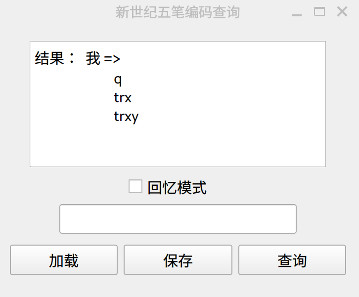

# 新世纪五笔编码查询工具

### 简要说明

本仓库提供了两种可用于查询新世纪五笔编码的工具：命令行版本和基于Qt5的GUI版本；同时也提供了预编译好的可执行文件。

### 命令行版本

在本仓库的`releases/v0.1.2`文件夹下，有两个可执行文件，分别可用以在`GNU/Linux`和`Windows`系统下运行：

```
$ wbdict 五笔 编码 战战兢兢 齉
五笔编码：  五笔 =>
	ggtt
五笔编码：  编码 =>
	xydc
五笔编码：  战战兢兢 =>
	hhdd
五笔编码：  齉 =>
	thle
```

该目录下的`wbdict.exe`需要`Windows10`及以上的系统。

### 基于Qt5的GUI版本

在`releases/v0.1.3`文件夹下，提供了两个可执行文件，它们是基于`Qt5.15`版本的新世纪五笔词库查询工具。除了简单的词组编码查询功能外，它还提供了简单查询历史的文件导入导出功能。在“回忆模式”下，该版本工具会遍历当前的查询历史，用户需要输入当前展示的词组，可用于训练词组的输入编码：



针对`Windows`版本的工具，用户需要自行安装`Qt5.15.2`版本的`Qt`软件，需要使用`Mingw810` 64位版本的库文件。